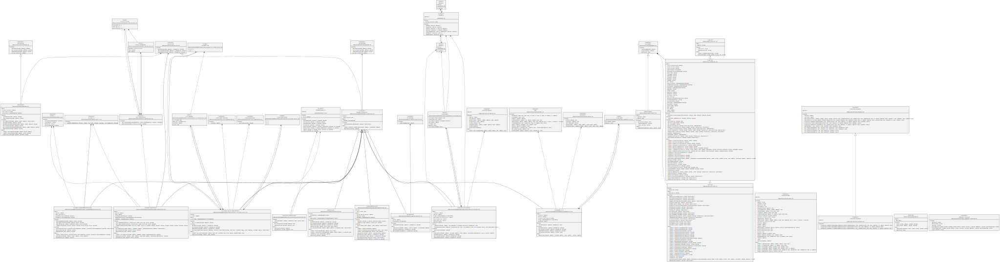

# Lending Contracts

Contracts for the MCLB lending platform.

## Set Up

1. Run `yarn setup` to build the hardon extension and generate the deployer account. The mnemonic is saved in the ./mnemonics folder.

## Development

The repo is set up to Hardhat.

You can start a blank node with `yarn hh:node` which will automatically run deployments.

You can also fork the Fantom Network using `yarn hh:node:ftm`. The fork will use the already deployed contracts and replace the Price Oracle by a mock instance so you can change the returned value.

## Documentation
You can generate UML diagrams using `yarn uml`

## Deployments

You can deploy new contracts by scripting the deployment and using the `yarn deploy --network MY_NETWORK --tags MY_TAG`. You can then verify contracts with `npx hardhat etherscan-verify`. Make sure to set your API key and urls properly.

Deployments can be found in ./deployments folder.