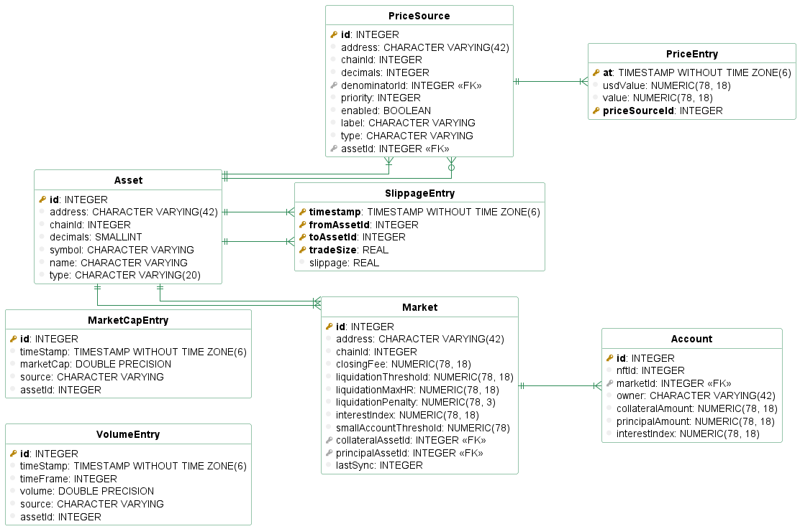
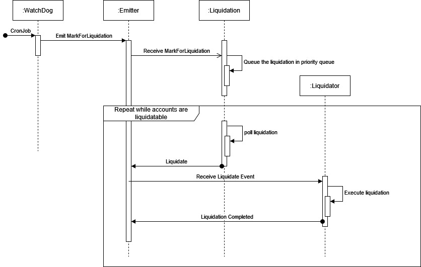

# Monitoring Service

Monitoring service provides functionality to keep track of vaults, users, collaterals and debts.
An immidiate benefit of having this information is determining the liquidatable (or close to liquidation) vaults, without a need to query blockchain every single time.

## Getting Started

### Dependencies
1. To get started, Docker needs to be installed. You can find more information about docker in the link below:
https://www.docker.com/

2. To use `@mclb/lending-api`, you need to build it with the latest version of the contracts. To do so, compile the contracts and then build the api using the following command:
```bash
$ yarn w:contracts compile 
$ yarn w:api build
```

### Installation
1. To install all the required packages, run the following command in terminal:
```bash
$ yarn install
```
This will install all required packages automatically.

2. Copy the .env file and fill it.
```bash
$ cp .env.example .env
```

## Development
Start the database
```bash
$ docker compose up -d db
```
To start the service locally
```
$ yarn start:dev
```

Once you are ready to push and deploy your changes, you can test the container can build and run properly using.
```bash
yarn docker:build:rebuild
```
Note that every time you restart the container, the database will be backed up in the `db_backups` folder.

### Migration Generation

When in development you can turn on synchronization, but it is not recommenced for production application.

To generate the new migration you database needs to be at the latest revision. 

1. Make sure all your entites are included in `src/entities.ts`
2. Run `yarn migration:generate {PATH_TO_MIGRATION}/{NAME_OF_MIGRATION}` which will create a migration file. The migration will change the schema from the preivous version to reflect your current Typeorm Entities.
3. Add the generated migration to the `migrations\index.ts` file.

Run the migration and the service to verify everything works 
```bash
$ yarn build && yarn migration:run
```

## Deployment

The container is automatically built using an action on Github.

You can use the file in `deployment/docker-compose.yml` to deploy your own instance of the monitoring service. Make sure to provide all env variables required.

## Documentation

The architecture of the liquidation bot is made to be easy to run on public infrastructure. Indeed, we decided to build it this way so many user can partake in the liquidation to provide more stability and redundancy to the market. It is very important for the market to have enough liquidators to avoid some accounts having bad debt.

For this reason, the architecture is polled based so the polling rate can be adjusted to fit the rate limit.

### DB Schema

We use Timescale a PGSql DB made for time series data like prices. Entities with the Entry suffix are TimeSeries so they do not have ID and have Hypertables enabled on their tables.

Storing huge numbers reliably can be a hard task, but we use the NUMERIC(78,18) type for everything that requires high precision. This means that we can store uint256 with 18 decimals of precision (tokens rarely have higher precision).



### Blockchain Integration


**Lending Platform**
The LendingClub service is the gateway to query the blockchain about the platform state.

Events are queried periodically in LendingClubSync service on every market to know which ones are out of sync with the DB. The accounts are then queried and updated in the DB.

**Prices**
A complete system for price tracking has been created in the AssetsModule.

An asset is linked to price source and prices are then saved with their price source origin. Making it possible to compare price source for different assets. 

### Liquidating

The HealthRatioWatchdog periodically queries the DB to determine which accounts are liquidatable. Events are then sent to queue the liquidation. Liquidations are done in order of the lowest health ratio first, by Liquidator Services. There can be many liquidator service to liquidate various types of collateral.

We use an event driven architecture to decouple the liquidation search from the actual liquidation. This gives the bot better flexibility to support more complex liquidation and different liquidation contracts.



### Metric Tracking

The Metric Tracking's goal is to provide administrator with some analytics about the tokens on the platform.

Currently tracked metrics are:
- Slippage for trade size of 10k$, 50k$ and 100k$
- Volume
- Market Cap

### Notifications

Notifications about liquidations are sent through Discord